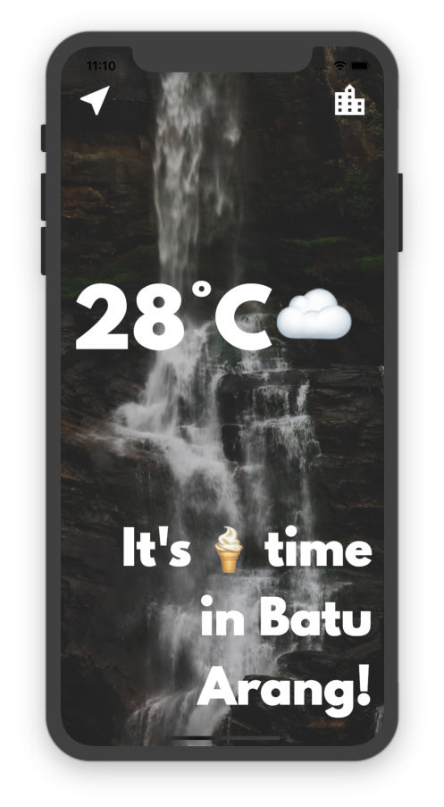

    

# Flutter Clima

A simple weather app. Developed using Flutter.

### Library Used

- Material
- Convert
- Geolocator
- Flutter SpinKit
- HTTP

### Widgets / Classes Used

Too many to mention.

### Concepts Used

- HTTP request
- Asynchronous operation
- GPS / Geolocation
- JSON
- Navigation
- Flutter lifecycle